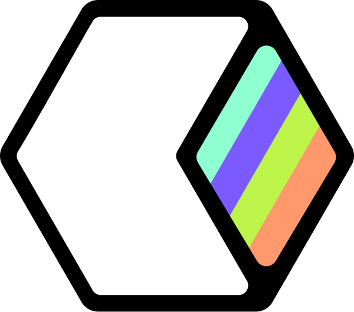

# WindAI Browser

<div align="center">
  
  
  **AI-Powered Browser Built by Neural Arc Inc**
  
  [](https://opensource.org/licenses/MIT)
  [](https://electronjs.org/)
  [](https://github.com/neuralarc/windai-browser)
</div>

## 🌟 Overview

WindAI Browser is a next-generation AI-powered web browser that combines modern browsing capabilities with intelligent AI assistance. Built with Electron and powered by multiple AI models, it provides a seamless browsing experience with contextual AI support.

## ✨ Features

### 🤖 AI Integration
- **Multiple AI Models**: Qwen 2.5 72B, Mistral 7B, DeepSeek R1
- **Smart Fallback System**: Automatic model switching for reliability
- **Contextual Chat**: AI assistance while browsing
- **Page Analysis**: AI-powered content understanding

### 🌐 Browsing Capabilities
- **Smart URL Handling**: Automatic protocol detection
- **Search Integration**: Direct Google search functionality
- **External Browser Integration**: Seamless website opening
- **Navigation History**: Back/forward functionality
- **Modern UI**: Beautiful gradient design with Neural Arc branding

### 📱 Dual Platform Support
- **🖥️ Desktop Version**: Full Electron app for native experience
- **🌐 Web Version**: Browser-compatible for CodeSandbox/online use
- **📱 Mobile Responsive**: Works on all devices
- **⚡ No Dependencies**: Web version works standalone

### ⚡ Performance
- **Cross-Platform**: Native support for macOS, Windows, and Linux
- **Fast Startup**: Optimized Electron architecture
- **Responsive Design**: Adaptive interface for all screen sizes
- **Secure**: Built with modern web security standards

## 🚀 Quick Start

### 🖥️ Desktop Version (Electron)

#### Prerequisites
- Node.js 18+ installed
- npm or yarn package manager

#### 🚀 **Quick Start**

Choose your preferred version:

### 🍎 **Native macOS Version** (Xcode/Swift) - **RECOMMENDED**
```bash
# Clone the repository
git clone https://github.com/Ampersand-AI/windai-browser.git
cd windai-browser/xcode-version

# Open in Xcode
open WindAI-Browser.xcodeproj

# Click Run (⌘R) in Xcode
# WindAI Browser launches with native performance!
```

### 🖥️ **Desktop Version** (Electron)
```bash
# Clone the repository
git clone https://github.com/Ampersand-AI/windai-browser.git
cd windai-browser

# Install dependencies
npm install

# Start the browser
npm start
```

### 🌐 **Web Version** (Browser/CodeSandbox)
```bash
# Navigate to web version
cd web-version

# Install dependencies
npm install

# Start the web server
npm start

# Or open index.html directly in any browser
# No installation required!
```
# Build for current platform
npm run build

# Build for macOS
npm run build-mac

# Build for Windows
npm run build-win

# Build for Linux
npm run build-linux

# Build for all platforms
npm run build-all
```

## 🛠️ Development

### Project Structure

```
windai-browser/
├── src/
│   └── main.js              # Main Electron process
├── assets/
│   ├── images/              # Logo and branding assets
│   └── icons/               # Application icons
├── index.html               # Main browser interface
├── package.json             # Project configuration
└── README.md               # This file
```

### Environment Setup

1. **Clone the repository**
2. **Install dependencies**: `npm install`
3. **Start development**: `npm start`
4. **Open DevTools**: The browser includes developer tools for debugging

### AI Configuration

The browser supports OpenRouter API integration. To configure:

1. Get your OpenRouter API key from [OpenRouter](https://openrouter.ai/)
2. The browser will use the following model hierarchy:
   - Primary: Qwen 2.5 72B Instruct
   - Fallback 1: Mistral 7B Instruct  
   - Fallback 2: DeepSeek R1

## 🎨 Design

WindAI Browser features a modern design with:
- **Gradient Toolbar**: Purple to cyan gradient reflecting AI innovation
- **Clean Interface**: Minimalist design focused on usability
- **Responsive Layout**: Adapts to different screen sizes
- **Neural Arc Branding**: Consistent brand identity throughout

## 🔧 Configuration

### Build Configuration

The `package.json` includes comprehensive build settings for:
- **macOS**: DMG installer with universal binary support
- **Windows**: NSIS installer for x64 and x86
- **Linux**: AppImage for maximum compatibility

### Customization

- **Branding**: Update logos in `assets/images/`
- **Colors**: Modify CSS gradients in `index.html`
- **Features**: Extend functionality in `src/main.js`

## 📱 Platform Support

| Platform | Status | Installer |
|----------|--------|-----------|
| macOS (Intel) | ✅ Supported | DMG |
| macOS (Apple Silicon) | ✅ Supported | DMG |
| Windows 10/11 | ✅ Supported | NSIS |
| Linux (Ubuntu/Debian) | ✅ Supported | AppImage |

## 🤝 Contributing

We welcome contributions! Please see our contributing guidelines:

1. Fork the repository
2. Create a feature branch
3. Make your changes
4. Test thoroughly
5. Submit a pull request

## 📄 License

This project is licensed under the MIT License - see the [LICENSE](LICENSE) file for details.

## 🏢 About Neural Arc Inc

WindAI Browser is built by Neural Arc Inc, a company focused on AI-powered productivity tools and innovative software solutions.

- **Website**: [neuralarc.com](https://neuralarc.com)
- **Contact**: info@neuralarc.com
- **GitHub**: [@neuralarc](https://github.com/neuralarc)

## 🙏 Acknowledgments

- **Electron**: For the cross-platform framework
- **OpenRouter**: For AI model API access
- **Open Source Community**: For inspiration and tools

## 📊 Roadmap

### Version 1.1 (Coming Soon)
- [ ] Built-in web view (iframe alternative)
- [ ] Bookmark management
- [ ] Tab support
- [ ] Enhanced AI features
- [ ] Extension system

### Version 1.2 (Future)
- [ ] Voice commands
- [ ] Advanced automation
- [ ] Custom themes
- [ ] Sync across devices

---

<div align="center">
  <strong>Built with ❤️ by Neural Arc Inc</strong>
  <br>
  <em>Empowering the future of browsing with AI</em>
</div>

